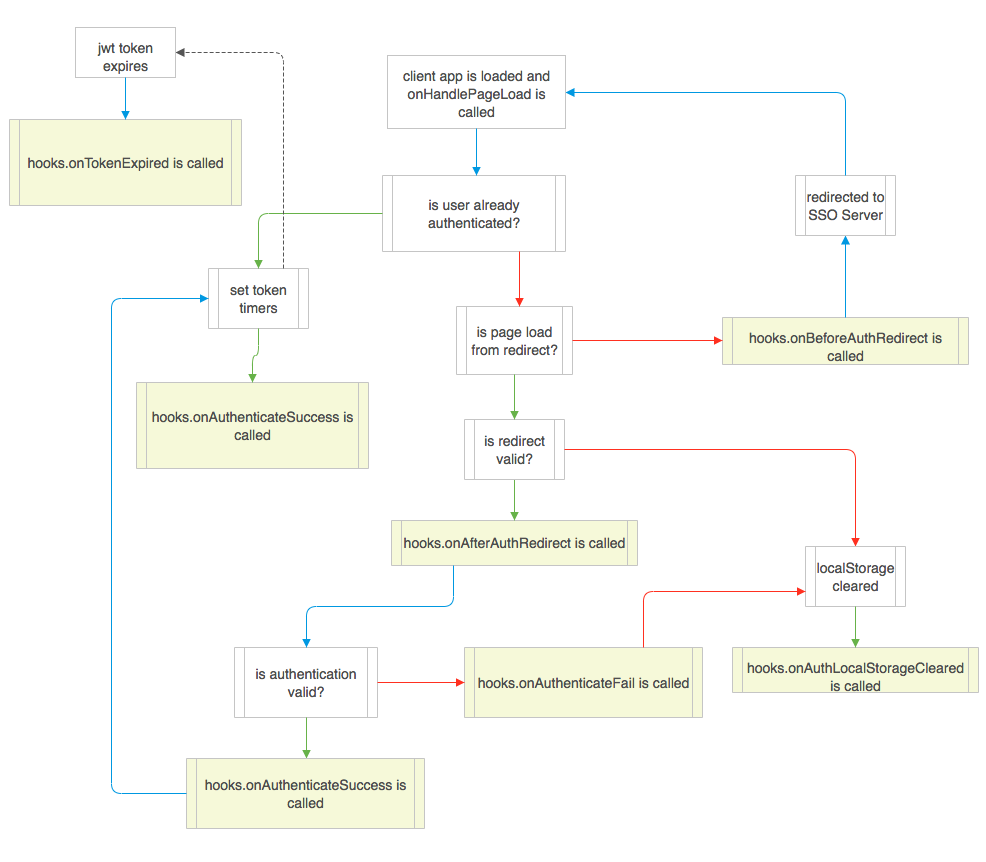

# Implicit Auth Manager

This is an implementation of the Open Id Connect Implicit Authorization. It follow's best practices as defined by the the [Open Id Connect Specs](https://openid.net/developers/specs/)

## Installation

```npm install --save @bcgov/nodejs-common-utils```


## Usage

The class provides a high and low level API depending on your implementation. The **High Level API** is recommended as it covers the best practices in an implicit auth flow. Otherwise, it will be up to you to ensure you are meeting specification for your implementation.

Regardless of how you choose to use the manager, a configuration object is required to setup the object

```javascript
// somewhere in a root level script
import { ImplicitAuthManager } from '@bcgov/nodejs-common-utils';

const implicitAuthManager = new ImplicitAuthManger({...});
// main routine that handles token storage and auth redirects
implicitAuthManager.handleOnPageLoad();
```

The above script is the recommended way of using the manager. The `handleOnPageLoad()` will trigger events like page redirects and token expiry automatically. In a **React** app this code would most likely live somewhere near the root level of your component tree as it should be called shortly after page load. The `hooks` configuration obejct will allow you to tie your React code with the implicitAuthManager in that case.

### configuration
>Mandatory Properties
```javascript
  {
    baseURL: "path to your sso domain", // https://sso-app.awesome.com,
    realmName: "myRealm", // this will be the realm your client lives in (also found within your sso server console)
    clientId: "myClient", // this should be the id of the client you registered within your sso server console
  }
```
>Optional Properties

- ```redirectURI``` (defaults to `window.location.origin`)

  redirectURI can be passed in as either a `String` or a `Function`. The redirectURI (if left at default or passed in as a string) after processing will receive a `intention` as a query parameter whenever it's being used to generate a URI. This intention will allow you to differentiate and redirects for different reasons. 

  for example
  ```javascript
    //if redirect uri defaulted to window.location.origin
    //during an authentication request
    const implicitAuthManager = new ImplicitAuthManager({...});
    console.log(implicitAuthManager.getSSOLoginURI()); 
    // => baseURI?client_id=...&response_type=...&nonce=...&redirect_uri=${window.location.origin}?intention=LOGIN&sso=true
    //during a loqout request..
    console.log(implicitAuthManager.getSSOLogoutURI());
    // => baseURI?redirect_uri=${window.location.origin}?intention=LOGOUT&sso=true
  ```

  ```javascript
    //if redirect uri was passed into config as a custom string
    //during an authentication request
    const implicitAuthManager = new ImplicitAuthManager({..., redirect_uri: 'https://mysite.com'});
    console.log(implicitAuthManager.getSSOLoginURI()); 
    // => baseURI?client_id=...&response_type=...&nonce=...&redirect_uri=https://mysite.com?intention=LOGIN&sso=true
    //during a loqout request..
    console.log(implicitAuthManager.getSSOLogoutURI());
    // => baseURI?redirect_uri=https://mysite.com?intention=LOGOUT&sso=true
  ```
  please note at this time, the logic to append the `intention` of a custom redirect uri as a `String` will not handle a uri
  that already has query params *\*cough\** make a pr *\*cough\** 

  If the *intention* mechanism doesn't suit your needs and you'd prefer to have custom uris for different auth situations. The *redirect_uri* as a `Function` is just for you. Your function will recieve the `intention` and therefore you can create a custom url based on the `intention`.

  ```javascript
    const buildRedirectURIFromIntention = (intention) => {
      const intentions = ImplicitAuthManager.validIntentions();
      switch(intention) {
        case intentions.LOGIN:
          return 'https://mysite.com/login';
        break;
        case intentions.LOGOUT:
          return 'https://mysite.com/logout';
        break;
      }
    }

    const implicitAuthManager = new ImplicitAuthManager({..., redirect_uri: buildRedirectURIFromIntention});
    console.log(implicitAuthManager.getSSOLoginURI());
    // => baseURI?client_id=...&response_type=...&nonce=...&redirect_uri=https://mysite.com/login
    console.log(implicitAuthManager.getSSOLogoutURI());
    // => baseURI?redirect_uri=https://mysite.com/logout
  ```
- `loginURIResponseType` (defaults to `'id_token'`). Other options are:
  - `'token'`
  - `'id_token'`
  - `'id_token token'`

  for more information see [3.2.2.1 Implicit Authentication Request](https://openid.net/specs/openid-connect-core-1_0.html#ImplicitAuthRequest)
- `hooks` This is the high level API which provides several access points to 'do something' during the authorization flow. The following hooks are available: 
  - `onBeforeAuthRedirect`: this is called prior to automatically redirecting your client to the authentication server
  - `onAfterAuthRedirect`: this is called after ImplicitAuthManager detects the page was loaded via a redirect from the authentication server
  - `onAuthLocalStorageCleared`: this is called when the `clearAuthLocalStorage()` instance method is called
  - `onTokenExpired`: this is called when the timers for jwt token expiry dates fire. If the auth local storage contains both an access token or id token, it will be called twice.
  - `onAuthenticateFail`: this is called when ImplicitAuthManager recieves credentials to authenticate a user but it had failed for some reason (jwt parse failure, replay attack etc)
  - `onAuthenticateSuccess`: this is called when ImplicitAuthManager successfully validates credentials from the auth server or finds valid tokens within local storage.

  ```javascript
    const config = {
      ...,
      hooks: {
        onTokenExpired: () => {
          //do something here
        }
      }
    }
    const implicitAuthManager = new ImplicitAuthManager(config);
  ```
  
## API

### static methods
these are mostly providers of constants that are attached to this class. They are consumed by the instance but may also be helpful outisde.
```javascript
  class.validResponseTypes() { array } // => returns all valid response types during auth as per open id connect implicit flow specs
  class.validPromptTypes() { array } // => returns all valid prompt types during auth per open id connect implicit flow specs
  class.validAPIIntentions() { object } // => returns all valid intentions which are used to construct redirect uri's
  class.validHooks() { array } // => returns all valid hook types
```

### getters

  Some getters are included as a utility for your needs
  
  ```javascript
    const iam = new ImplicitAuthManager({...});

    iam.redirectURI { String }
    iam.ssoLogoutURI { String }
    iam.ssoLoginURI { String }
    iam.access_token { Object }
    iam.id_token { Object }
  ```

### instance methods

```javascript
  instance.clearAuthLocalStorage(); { undefined } 
  // clears local storage keys 'sso' and 'auth'

  instance.createBaseAuthEndpointFromConfig(); { String } 
  // with config builds the base sso authorization 
  // end point as per open id connect specs

  instance.createBaseLogoutEndpointFromConfig(); { String } 
  // with config builds the base sso end session
  // end point as per open id connect specs

  instance.createNonce(); { String } 
  // creates a request key which is automatically stored in 
  // localstorage @ sso.requestKey and returns a hash of it to be used as a nonce

  instance.isAReplayAttack(nonce { String }); { Boolean } 
  // detects replay attack by comparing nonce with request key found in localstorage

  instance.isTokenExpired(token { Object }); { Boolean }

  instance.areTokensExpired(); { Boolean } 
  // checks local storage for tokens and return true if ANY ONE token is expired

  instance.getParameterByName(hash { String }, name { String }); { String } 
  // parses a url fragment or hash (www.mysite.com#foo=bar)
  // instance.getParameterByName(window.location.hash, 'foo');
  
  instance.getAccessTokenFromHash(hash { String }); { String }
  // as above but looks for 'access_token' within hash
  
  instance.getIdTokenFromHash(hash { String }); { String }
  // as above but looks for 'id_token' within hash

  instance.getErrorFromHash(hash { String }); { String }
  // as above but looks for 'error' within hash

  instance.getAccessTokenFromLocal(); { Object } 
  // returns jwt token or undefined if not found

  instance.getIdTokenFromLocal(); { Object } 
  // returns jwt token or undefined if not found

  instance.saveAuthDataInLocal(access_token { Object || undefined }, id_token { Object || undefined}); { Boolean } 
  // automatically checks for replay attacks by comparing nonce within token with request key
  // if tokens are not parsable or if a replay attack had occured then the tokens will not be saved
  // and false is returned
  // if tokens are valid true is returned

  instance.getSSOLoginURIForPageLoadRedirect() { String }
  // very similar to instance.ssoLoginURI with the exception of the query parameter &prompt=none
  // which prevents the user being forced to login into the sso authentication server

  instance.handleOnPageLoad() { undefined }
  // MAIN routine. this will be described in detail below

  instance.getAuthDataFromLocal() { Object }
  // returns the tokens saved in localstorage.auth

  instance.isPageLoadHashValidForAuthentication() { Boolean }
  // returns false if url fragment/hash doesn't match the expected shape we'd recieve from the sso server
  
  instance.isAuthenticated() { Boolean }
  // returns true/false based on if valid/non-expired tokens exist in local storage

  instance.setTokenExpiryTimers() { undefined }
  // sets the expiry timers via setTimeout
  // the onTokenExpired event is fired within the setTimeout callback
```

#### handleOnPageLoad Routine

This is the main routine that controls implicit auth.
Here is a flow chart for the routine. 



## Things that are missing

At this point automatic refreshing of tokens is not implemented as the specification for its implementation is different compared to a traditional authorization flow.